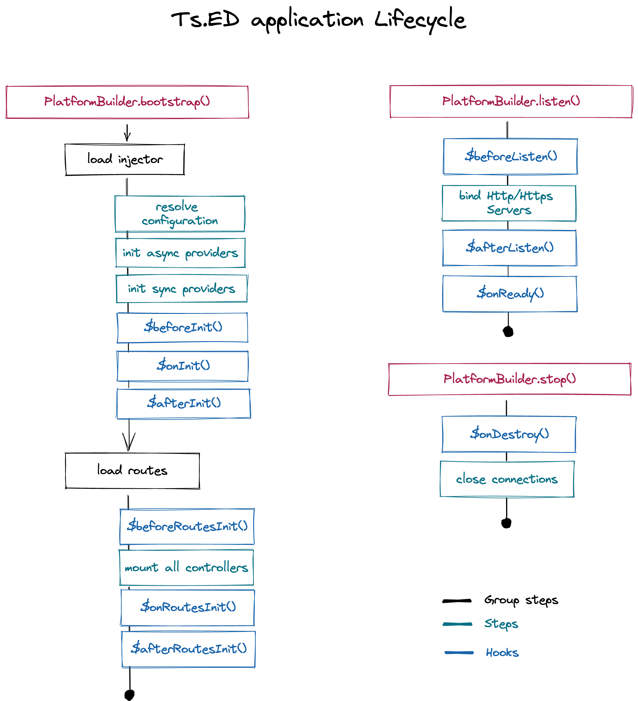

# Hooks

## Introduction

Ts.ED emits different events during its initialization
phase (lifecycle). These lifecycle hooks provide visibility into these key life moments and the ability to act
when they occur.

This schema resume the order of hooks regard to the providers:



Here is the related code described by the previous schema:

```typescript
async function bootstrap() {
  try {
    const platform = await PlatformExpress.bootstrap(Server);
    await platform.listen();

    process.on("SIGINT", () => {
      platform.stop();
    });
  } catch (error) {
    $log.error({event: "SERVER_BOOTSTRAP_ERROR", message: error.message, stack: error.stack});
  }
}

bootstrap();
```

All providers are called by the emitted `event` and any provider can also emit his own `event`.

::: tip
By convention

- A hook is always prefixed by `$`,
- A hook is emitted from a module,
- A module subscribe to a hook.

:::

## Subscribe to a hook

### Server

You can subscribe to a hook in your Server:

```typescript
import {BeforeInit, Configuration} from "@tsed/di";

@Configuration({})
class Server implements BeforeInit {
  async $beforeInit(): Promise<any> {}
}
```

### Module / Service

You can subscribe to a hook in your @@Module@@ or @@Service@@:

```typescript
import {Module, OnInit} from "@tsed/di";

@Module()
export class MyModule implements OnInit {
  async $onInit(): Promise<any> {}
}
```

::: tip Note
Database connection can be performed with Asynchronous Provider. See [custom providers](/docs/custom-providers)
:::

### $onRequest/$onResponse

Ts.ED provide a way to intercept the request and response event. You can listen these hooks by implementing a `$onRequest` and `$onResponse` methods
on an injectable service:

```typescript
import {Module} from "@tsed/di";
import {PlatformContext} from "@tsed/platform-http";

@Module()
class CustomContextModule {
  $onRequest($ctx: PlatformContext) {
    // do something
  }
  $onResponse($ctx: PlatformContext) {
    // do something
  }
}
```

### Custom provider

It's also possible to subscribe to a hook in a [custom provider](/docs/custom-providers):

```typescript
import {injectable, constant} from "@tsed/di";
import {DatabaseConnection, Options} from "connection-lib";

export const CONNECTION = injectable<DatabaseConnection>(Symbol.for("CONNECTION"))
  .factory(() => {
    const options = constant<Options>("myOptions");

    return new DatabaseConnection(options);
  })
  .hooks({
    $onDestroy(connection) {
      // called when provider instance is destroyed
      return connection.close();
    }
  })
  .token();
```

It's now easy to close database connection through the `hooks` methods!

## Emit event

Emit event let the developers subscribe and implement his tasks.

```ts
import {Module, $emit} from "@tsed/di";

export interface OnEvent {
  $myEvent(value: string): Promise<void>;
}

@Module()
export class ModuleEmitter {
  async initSomething() {
    // do something before

    await $emit("$myEvent"); // emit accept extra parameters forwarded to subscribers

    // do something after
  }
}
```

A subscriber:

```typescript
import {Module} from "@tsed/di";
import {OnEvent} from "./ModuleEmitter.js";

@Module()
export class ModuleSubscriber extends OnEvent {
  $alterEvent() {
    // do something
  }
}
```

## Alterable value event

This feature let you emit an event with a value. All providers who subscribe to it can modify the value passed as a parameter and return a new value which will be passed to the next provider.

```ts
// module-emitter
import {inject, Module, $alterAsync} from "@tsed/di";

export interface AlterEvent {
  $alterEvent(value: string): Promise<string>;
}

@Module()
export class ModuleEmitter {
  async initSomething() {
    // do something before
    const value = $alterAsync("$alterEvent", "hello"); // alterAsync and alter accept extra parameters forwarded to subscribers

    console.log(value); // "hello-world"
    // do something after
  }
}
```

A subscriber:

```typescript
import {Module} from "@tsed/di";
import {AlterEvent} from "./ModuleEmitter.js";

@Module()
export class ModuleSubscriber extends AlterEvent {
  $alterEvent(value: any) {
    return value + " world";
  }
}
```
